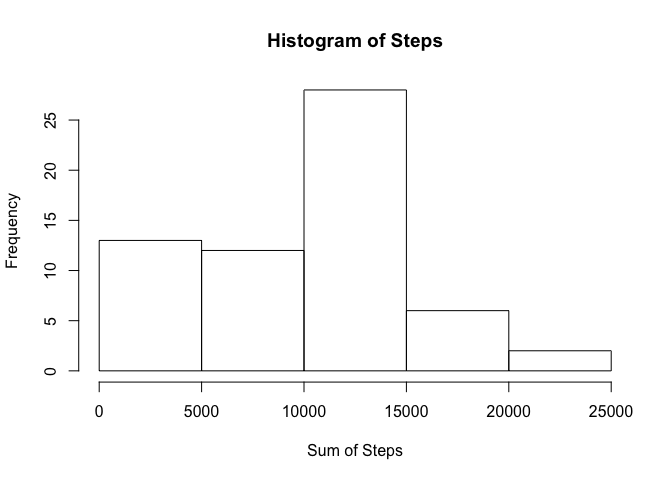
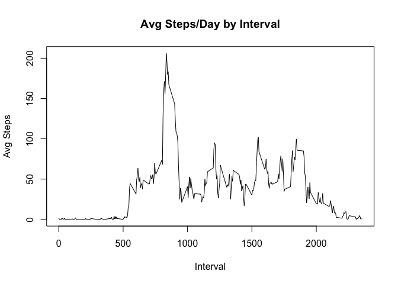
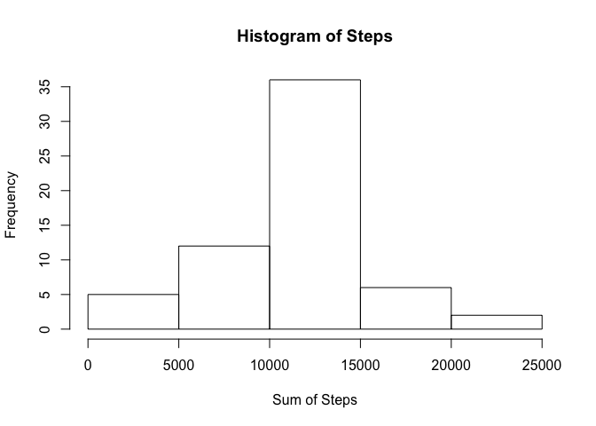
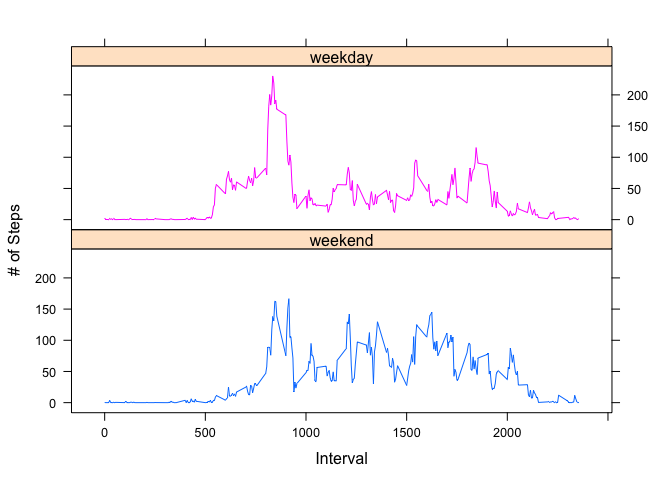

### Find sum by day without NA values and plot in a histogram

``` r
sum_nona<-aggregate(act_org$steps, by = list(act_org$date), na.rm = TRUE, FUN = sum)

## Apply friendly column names
colnames(sum_nona)<-c("Date", "SumSteps")

## Create a histogram of steps per day
hist(sum_nona$SumSteps, xlab = "Sum of Steps", main = "Histogram of Steps")
```



``` r
###Find mean by day without NA values
mean_nona<-aggregate(act_org$steps, by = list(act_org$date), na.rm = TRUE, FUN = mean)

###Apply friendly column names
colnames(mean_nona)<-c("Date", "MeanSteps")

###Find median by day without NA values
med_nona<-aggregate(act_org$steps, by = list(act_org$date), na.rm = TRUE, FUN = median)

## Apply friendly column names
colnames(med_nona)<-c("Date", "MedianSteps")
```

### Print median by day

``` r
print(med_nona)
```

    ##          Date MedianSteps
    ## 1  2012-10-01          NA
    ## 2  2012-10-02           0
    ## 3  2012-10-03           0
    ## 4  2012-10-04           0
    ## 5  2012-10-05           0
    ## 6  2012-10-06           0
    ## 7  2012-10-07           0
    ## 8  2012-10-08          NA
    ## 9  2012-10-09           0
    ## 10 2012-10-10           0
    ## 11 2012-10-11           0
    ## 12 2012-10-12           0
    ## 13 2012-10-13           0
    ## 14 2012-10-14           0
    ## 15 2012-10-15           0
    ## 16 2012-10-16           0
    ## 17 2012-10-17           0
    ## 18 2012-10-18           0
    ## 19 2012-10-19           0
    ## 20 2012-10-20           0
    ## 21 2012-10-21           0
    ## 22 2012-10-22           0
    ## 23 2012-10-23           0
    ## 24 2012-10-24           0
    ## 25 2012-10-25           0
    ## 26 2012-10-26           0
    ## 27 2012-10-27           0
    ## 28 2012-10-28           0
    ## 29 2012-10-29           0
    ## 30 2012-10-30           0
    ## 31 2012-10-31           0
    ## 32 2012-11-01          NA
    ## 33 2012-11-02           0
    ## 34 2012-11-03           0
    ## 35 2012-11-04          NA
    ## 36 2012-11-05           0
    ## 37 2012-11-06           0
    ## 38 2012-11-07           0
    ## 39 2012-11-08           0
    ## 40 2012-11-09          NA
    ## 41 2012-11-10          NA
    ## 42 2012-11-11           0
    ## 43 2012-11-12           0
    ## 44 2012-11-13           0
    ## 45 2012-11-14          NA
    ## 46 2012-11-15           0
    ## 47 2012-11-16           0
    ## 48 2012-11-17           0
    ## 49 2012-11-18           0
    ## 50 2012-11-19           0
    ## 51 2012-11-20           0
    ## 52 2012-11-21           0
    ## 53 2012-11-22           0
    ## 54 2012-11-23           0
    ## 55 2012-11-24           0
    ## 56 2012-11-25           0
    ## 57 2012-11-26           0
    ## 58 2012-11-27           0
    ## 59 2012-11-28           0
    ## 60 2012-11-29           0
    ## 61 2012-11-30          NA

### Print mean by day

``` r
print(mean_nona)
```

    ##          Date  MeanSteps
    ## 1  2012-10-01        NaN
    ## 2  2012-10-02  0.4375000
    ## 3  2012-10-03 39.4166667
    ## 4  2012-10-04 42.0694444
    ## 5  2012-10-05 46.1597222
    ## 6  2012-10-06 53.5416667
    ## 7  2012-10-07 38.2465278
    ## 8  2012-10-08        NaN
    ## 9  2012-10-09 44.4826389
    ## 10 2012-10-10 34.3750000
    ## 11 2012-10-11 35.7777778
    ## 12 2012-10-12 60.3541667
    ## 13 2012-10-13 43.1458333
    ## 14 2012-10-14 52.4236111
    ## 15 2012-10-15 35.2048611
    ## 16 2012-10-16 52.3750000
    ## 17 2012-10-17 46.7083333
    ## 18 2012-10-18 34.9166667
    ## 19 2012-10-19 41.0729167
    ## 20 2012-10-20 36.0937500
    ## 21 2012-10-21 30.6284722
    ## 22 2012-10-22 46.7361111
    ## 23 2012-10-23 30.9652778
    ## 24 2012-10-24 29.0104167
    ## 25 2012-10-25  8.6527778
    ## 26 2012-10-26 23.5347222
    ## 27 2012-10-27 35.1354167
    ## 28 2012-10-28 39.7847222
    ## 29 2012-10-29 17.4236111
    ## 30 2012-10-30 34.0937500
    ## 31 2012-10-31 53.5208333
    ## 32 2012-11-01        NaN
    ## 33 2012-11-02 36.8055556
    ## 34 2012-11-03 36.7048611
    ## 35 2012-11-04        NaN
    ## 36 2012-11-05 36.2465278
    ## 37 2012-11-06 28.9375000
    ## 38 2012-11-07 44.7326389
    ## 39 2012-11-08 11.1770833
    ## 40 2012-11-09        NaN
    ## 41 2012-11-10        NaN
    ## 42 2012-11-11 43.7777778
    ## 43 2012-11-12 37.3784722
    ## 44 2012-11-13 25.4722222
    ## 45 2012-11-14        NaN
    ## 46 2012-11-15  0.1423611
    ## 47 2012-11-16 18.8923611
    ## 48 2012-11-17 49.7881944
    ## 49 2012-11-18 52.4652778
    ## 50 2012-11-19 30.6979167
    ## 51 2012-11-20 15.5277778
    ## 52 2012-11-21 44.3993056
    ## 53 2012-11-22 70.9270833
    ## 54 2012-11-23 73.5902778
    ## 55 2012-11-24 50.2708333
    ## 56 2012-11-25 41.0902778
    ## 57 2012-11-26 38.7569444
    ## 58 2012-11-27 47.3819444
    ## 59 2012-11-28 35.3576389
    ## 60 2012-11-29 24.4687500
    ## 61 2012-11-30        NaN

### Find average by day and interval without NA and plot in a time series line graph

``` r
avg_nona<-aggregate(act_org$steps, by = list(act_org$interval), na.rm = TRUE, FUN = mean)

## Apply friendly column names
colnames(avg_nona)<-c("Interval", "AvgSteps")

## Plot average steps by day/interval
plot(avg_nona$Interval, avg_nona$AvgSteps, type = "l", main = "Avg Steps/Day by Interval", xlab = "Interval", ylab = "Avg Steps")
```



### Find number of NA values in steps

``` r
print(sum(is.na(act_org$steps)))
```

    ## [1] 2304

``` r
## Use the mean interval to fill in the NA values 

## Set the loop variable
i<-1
z<-0
for (i in 1:17568)
  {
    j<-1
    if(is.na(act_org[i,1]))
    {
      for (j in 1:288)
      {
        if(act_org[i,3]==avg_nona[j,1])
        {
          act_org[i,1]<-avg_nona[j,2]
        }
      }
      
    }
    i<-i+1
}
```

Repeat with imputed values
--------------------------

### Find sum by day and plot in a histogram

``` r
## Find sum by day
sum_nona1<-aggregate(act_org$steps, by = list(act_org$date), na.rm = TRUE, FUN = sum)

## Apply friendly column names
colnames(sum_nona1)<-c("Date", "SumSteps")

## Create a histogram of steps per day
hist(sum_nona1$SumSteps, xlab = "Sum of Steps", main = "Histogram of Steps")
```



``` r
###Find mean by day
mean_nona1<-aggregate(act_org$steps, by = list(act_org$date), na.rm = TRUE, FUN = mean)

###Apply friendly column names
colnames(mean_nona1)<-c("Date", "MeanSteps")

###Find median by day
med_nona1<-aggregate(act_org$steps, by = list(act_org$date), na.rm = TRUE, FUN = median)

###Apply friendly column names
colnames(med_nona1)<-c("Date", "MedianSteps")
```

I chose to use the average per interval to fill in the NA values. Couple of issues:

-   I did not distiguish the average on a weekday vs. a weekend for each interval

-   I did not throw out any outliers, which could skew the values

The end result is a cleaner bell curve on the histogram because the missing values were normalized by taking the average. \#\#\#Print median by day

``` r
print(med_nona1)
```

    ##          Date MedianSteps
    ## 1  2012-10-01    34.11321
    ## 2  2012-10-02     0.00000
    ## 3  2012-10-03     0.00000
    ## 4  2012-10-04     0.00000
    ## 5  2012-10-05     0.00000
    ## 6  2012-10-06     0.00000
    ## 7  2012-10-07     0.00000
    ## 8  2012-10-08    34.11321
    ## 9  2012-10-09     0.00000
    ## 10 2012-10-10     0.00000
    ## 11 2012-10-11     0.00000
    ## 12 2012-10-12     0.00000
    ## 13 2012-10-13     0.00000
    ## 14 2012-10-14     0.00000
    ## 15 2012-10-15     0.00000
    ## 16 2012-10-16     0.00000
    ## 17 2012-10-17     0.00000
    ## 18 2012-10-18     0.00000
    ## 19 2012-10-19     0.00000
    ## 20 2012-10-20     0.00000
    ## 21 2012-10-21     0.00000
    ## 22 2012-10-22     0.00000
    ## 23 2012-10-23     0.00000
    ## 24 2012-10-24     0.00000
    ## 25 2012-10-25     0.00000
    ## 26 2012-10-26     0.00000
    ## 27 2012-10-27     0.00000
    ## 28 2012-10-28     0.00000
    ## 29 2012-10-29     0.00000
    ## 30 2012-10-30     0.00000
    ## 31 2012-10-31     0.00000
    ## 32 2012-11-01    34.11321
    ## 33 2012-11-02     0.00000
    ## 34 2012-11-03     0.00000
    ## 35 2012-11-04    34.11321
    ## 36 2012-11-05     0.00000
    ## 37 2012-11-06     0.00000
    ## 38 2012-11-07     0.00000
    ## 39 2012-11-08     0.00000
    ## 40 2012-11-09    34.11321
    ## 41 2012-11-10    34.11321
    ## 42 2012-11-11     0.00000
    ## 43 2012-11-12     0.00000
    ## 44 2012-11-13     0.00000
    ## 45 2012-11-14    34.11321
    ## 46 2012-11-15     0.00000
    ## 47 2012-11-16     0.00000
    ## 48 2012-11-17     0.00000
    ## 49 2012-11-18     0.00000
    ## 50 2012-11-19     0.00000
    ## 51 2012-11-20     0.00000
    ## 52 2012-11-21     0.00000
    ## 53 2012-11-22     0.00000
    ## 54 2012-11-23     0.00000
    ## 55 2012-11-24     0.00000
    ## 56 2012-11-25     0.00000
    ## 57 2012-11-26     0.00000
    ## 58 2012-11-27     0.00000
    ## 59 2012-11-28     0.00000
    ## 60 2012-11-29     0.00000
    ## 61 2012-11-30    34.11321

### Print mean by day

``` r
print(mean_nona1)
```

    ##          Date  MeanSteps
    ## 1  2012-10-01 37.3825996
    ## 2  2012-10-02  0.4375000
    ## 3  2012-10-03 39.4166667
    ## 4  2012-10-04 42.0694444
    ## 5  2012-10-05 46.1597222
    ## 6  2012-10-06 53.5416667
    ## 7  2012-10-07 38.2465278
    ## 8  2012-10-08 37.3825996
    ## 9  2012-10-09 44.4826389
    ## 10 2012-10-10 34.3750000
    ## 11 2012-10-11 35.7777778
    ## 12 2012-10-12 60.3541667
    ## 13 2012-10-13 43.1458333
    ## 14 2012-10-14 52.4236111
    ## 15 2012-10-15 35.2048611
    ## 16 2012-10-16 52.3750000
    ## 17 2012-10-17 46.7083333
    ## 18 2012-10-18 34.9166667
    ## 19 2012-10-19 41.0729167
    ## 20 2012-10-20 36.0937500
    ## 21 2012-10-21 30.6284722
    ## 22 2012-10-22 46.7361111
    ## 23 2012-10-23 30.9652778
    ## 24 2012-10-24 29.0104167
    ## 25 2012-10-25  8.6527778
    ## 26 2012-10-26 23.5347222
    ## 27 2012-10-27 35.1354167
    ## 28 2012-10-28 39.7847222
    ## 29 2012-10-29 17.4236111
    ## 30 2012-10-30 34.0937500
    ## 31 2012-10-31 53.5208333
    ## 32 2012-11-01 37.3825996
    ## 33 2012-11-02 36.8055556
    ## 34 2012-11-03 36.7048611
    ## 35 2012-11-04 37.3825996
    ## 36 2012-11-05 36.2465278
    ## 37 2012-11-06 28.9375000
    ## 38 2012-11-07 44.7326389
    ## 39 2012-11-08 11.1770833
    ## 40 2012-11-09 37.3825996
    ## 41 2012-11-10 37.3825996
    ## 42 2012-11-11 43.7777778
    ## 43 2012-11-12 37.3784722
    ## 44 2012-11-13 25.4722222
    ## 45 2012-11-14 37.3825996
    ## 46 2012-11-15  0.1423611
    ## 47 2012-11-16 18.8923611
    ## 48 2012-11-17 49.7881944
    ## 49 2012-11-18 52.4652778
    ## 50 2012-11-19 30.6979167
    ## 51 2012-11-20 15.5277778
    ## 52 2012-11-21 44.3993056
    ## 53 2012-11-22 70.9270833
    ## 54 2012-11-23 73.5902778
    ## 55 2012-11-24 50.2708333
    ## 56 2012-11-25 41.0902778
    ## 57 2012-11-26 38.7569444
    ## 58 2012-11-27 47.3819444
    ## 59 2012-11-28 35.3576389
    ## 60 2012-11-29 24.4687500
    ## 61 2012-11-30 37.3825996

### Plot activity weekends vs. weekdays

``` r
## Add factor for Weekday vs. Weekend
weekdays1 <- c('Monday', 'Tuesday', 'Wednesday', 'Thursday', 'Friday')
act_org$date<-as.Date(act_org$date)
act_org$wDay <- factor((weekdays(act_org$date) %in% weekdays1), levels=c(FALSE, TRUE), labels=c('weekend', 'weekday')) 
## Get the average steps
avg_interval_wd<-aggregate(act_org$steps, by = list(act_org$interval, act_org$wDay), FUN = mean)
## Apply friendly names
colnames(avg_interval_wd)<-c("interval", "wDay", "steps")
## Make the panel plot
xyplot(avg_interval_wd$steps~avg_interval_wd$interval|avg_interval_wd$wDay,type="l",group=avg_interval_wd$wDay, layout=c(1,2), xlab = "Interval", ylab = "# of Steps")
```



I would've expected the average on the weekend to be higher. However, the spike in the morning doesn't surprise me much since that's when a lot of people choose to work out.
